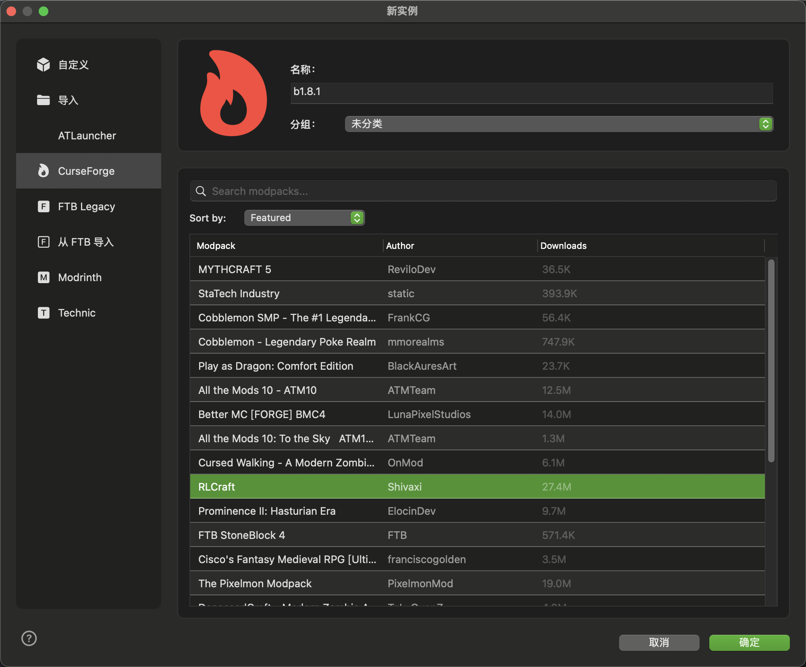

<div align="center">


# Minecraft 启动器

**功能完整的 Minecraft 启动器，支持实例管理、Mod 加载器、CurseForge 集成和 Microsoft 账户认证**

[](https://swift.org)
[](https://www.apple.com/macos)
[](LICENSE)

[English](../README.md) | 简体中文

</div>

---

## 目录

- [功能特性](#功能特性)
- [截图预览](#截图预览)
- [快速开始](#快速开始)
  - [系统要求](#系统要求)
  - [安装说明](#安装说明)
  - [运行项目](#运行项目)
- [使用指南](#使用指南)
  - [创建游戏实例](#创建游戏实例)
  - [添加账户](#添加账户)
  - [启动游戏](#启动游戏)
  - [导入 CurseForge 整合包](#导入-curseforge-整合包)
  - [配置代理](#配置代理可选)
- [技术栈](#技术栈)
- [开发进度](#开发进度)
  - [已完成功能](#已完成功能)
  - [计划功能](#计划功能)
- [贡献指南](#贡献指南)
- [许可证](#许可证)
- [Star History](#star-history)

---

## 功能特性

### 🎮 游戏管理
- **实例管理** - 创建、编辑、删除游戏实例，支持 MMC 格式（与 Prism Launcher 兼容）
- **游戏启动** - 完整的启动引擎，支持 JVM 参数配置和 Native 库管理
- **Java 检测** - 自动检测系统 Java 环境，智能匹配版本要求
- **版本管理** - 下载、缓存、安装 Minecraft 各版本（正式版/快照版/Beta/Alpha）

### 👤 账户系统
- **Microsoft 认证** - OAuth 2.0 + PKCE 安全流程，支持 Xbox Live 和 Minecraft Services
- **离线账户** - 支持离线模式游戏
- **多账户管理** - 轻松切换不同账户
- **Token 管理** - 自动刷新认证令牌

### 🔧 Mod 与整合包
- **Mod 加载器** - 支持 Forge、Fabric、NeoForge、Quilt
- **CurseForge 集成** - 搜索、浏览和导入 CurseForge 整合包
- **Modpack 管理** - 完整的整合包支持和版本管理

### ⚙️ 高级功能
- **代理支持** - HTTP/HTTPS/SOCKS5 代理配置
- **并发下载** - 多线程下载系统，支持 SHA1 完整性校验
- **国际化** - 完整支持英文和简体中文
- **日志系统** - 完善的多级别日志记录

---

## 截图预览

### 实例管理
实例管理界面提供了游戏实例的创建、编辑和管理功能。


*实例列表界面，显示所有已创建的 Minecraft 游戏实例*

### 新建实例
通过直观的对话框创建新的游戏实例，支持选择版本和自定义配置。


*新建实例对话框，可选择游戏版本并配置实例参数*

### Java 环境检测
自动检测系统中已安装的 Java 运行环境，支持多版本 Java 管理。


*Java 环境检测界面，显示所有可用的 Java 版本*

### 账户管理
支持多账户管理，方便切换不同的 Minecraft 账户进行游戏。


*账户管理界面，支持添加、编辑和切换游戏账户*

### 设置中心
全面的设置界面，提供启动器的各项配置选项。


*设置界面，可配置启动器的各项参数和偏好设置*

### CurseForge Modpack 导入
支持从 CurseForge 平台导入整合包（Modpack），快速创建预配置的游戏实例。



*CurseForge 整合包导入界面，可以直接导入流行的 Modpack*

---

## 快速开始

### 系统要求

- macOS 13.0 (Ventura) 或更高版本
- Xcode 15.0 或更高版本
- Swift 5.9 或更高版本

### 安装说明

1. 克隆仓库：
```bash
git clone https://github.com/yourusername/Launcher.git
cd Launcher
```

2. 在 Xcode 中打开项目：
```bash
open Launcher/Launcher.xcodeproj
```

### 运行项目

1. 在 Xcode 中选择 `Launcher` scheme
2. 按 `⌘+R` 构建并运行
3. 在主窗口中点击"打开测试窗口"按钮
4. 在测试窗口中测试各种功能

---

## 使用指南

### 创建游戏实例

1. 点击主界面的"添加实例"按钮
2. 在对话框中输入实例名称
3. 选择 Minecraft 版本
4. 选择 Mod 加载器（可选）：
   - None（原版）
   - Forge
   - Fabric
   - NeoForge
   - Quilt
5. 点击"创建"完成实例创建

### 添加账户

#### Microsoft 账户
1. 打开"账户管理"界面
2. 点击"添加 Microsoft 账户"
3. 在浏览器中完成 Microsoft 登录
4. 授权后自动返回启动器
5. 账户添加成功，可以看到你的玩家名和皮肤

#### 离线账户
1. 打开"账户管理"界面
2. 点击"添加离线账户"
3. 输入玩家名称
4. 点击"添加"完成

### 启动游戏

1. 在实例列表中选择要玩的实例
2. 在账户下拉菜单中选择账户
3. 点击"启动"按钮
4. 等待游戏启动（首次启动会自动下载所需文件）

### 导入 CurseForge 整合包

1. 点击"从 CurseForge 导入"按钮
2. 浏览或搜索想要的整合包
3. 选择整合包版本
4. 点击"导入"开始下载和安装
5. 导入完成后，新实例会自动出现在实例列表中

### 配置代理（可选）

如果需要使用代理访问 Minecraft 服务器：

1. 打开"设置"界面
2. 切换到"网络"标签
3. 启用代理并选择类型（HTTP/HTTPS/SOCKS5）
4. 输入代理服务器地址和端口
5. 点击"测试连接"验证代理
6. 保存设置

---

## 技术栈

- **语言**: Swift 5.9+
- **UI 框架**: AppKit（原生 macOS）
- **并发**: Swift Concurrency (async/await)
- **加密**: CryptoKit（SHA1 校验）
- **网络**: URLSession 自定义配置
- **存储**: FileManager、UserDefaults
- **日志**: 自定义多级别日志系统
- **国际化**: xcstrings 目录

---

## 开发进度

### 已完成功能

#### 核心功能
- [x] 版本列表获取和缓存
- [x] 版本详情解析
- [x] 版本继承处理
- [x] 多线程下载系统
- [x] SHA1 完整性校验
- [x] 实时进度追踪
- [x] 完善的日志系统
- [x] 按类型筛选版本
- [x] 代理支持（HTTP/HTTPS/SOCKS5）
- [x] 完整国际化（英文/简体中文）
- [x] 安装状态检查

#### 游戏启动
- [x] 游戏启动引擎
- [x] 离线 UUID 生成
- [x] JVM 参数配置
- [x] 游戏参数处理
- [x] Native 库提取
- [x] Classpath 构建
- [x] 平台兼容性检查（macOS 优化）

#### 账户系统
- [x] Microsoft 账户认证
- [x] OAuth 2.0 + PKCE 安全流程
- [x] Xbox Live 集成
- [x] Minecraft Services 认证
- [x] Token 刷新机制
- [x] 离线账户支持
- [x] 账户管理界面

#### 实例管理
- [x] 实例创建和删除
- [x] MMC 格式支持（与 Prism Launcher 兼容）
- [x] 实例配置管理
- [x] 游戏目录隔离（mods、saves、resourcepacks 等）
- [x] 实例列表界面
- [x] 实例详情查看和编辑

#### Mod 加载器
- [x] Forge 支持
- [x] Fabric 支持
- [x] NeoForge 支持
- [x] Quilt 支持
- [x] Mod 加载器版本管理

#### CurseForge 集成
- [x] CurseForge API 客户端
- [x] Modpack 搜索功能
- [x] Modpack 详情获取
- [x] 分页和排序支持
- [x] CurseForge 导入界面

#### Java 环境
- [x] Java 安装自动检测
- [x] 多版本 Java 管理
- [x] Java 版本匹配（根据 Minecraft 版本）
- [x] Java 检测界面

### 计划功能

#### 核心增强
- [ ] 自动更新功能
- [ ] 启动前资源完整性检查
- [ ] 自定义启动参数模板
- [ ] 性能监控和日志查看器

#### CurseForge 功能
- [ ] Modpack 下载和安装
- [ ] Modpack 自动更新
- [ ] Mod 浏览和搜索
- [ ] 单个 Mod 安装/更新/卸载

#### 资源管理
- [ ] 资源包浏览和管理
- [ ] 光影包支持
- [ ] 数据包管理
- [ ] 世界备份和恢复

#### 多人游戏
- [ ] 服务器列表管理
- [ ] 服务器快速连接
- [ ] 局域网游戏支持

#### 用户体验
- [ ] 主题和外观自定义
- [ ] 更多语言支持
- [ ] 快捷键配置
- [ ] 实例导入/导出（支持更多格式）

#### 高级功能
- [ ] 批量操作（批量更新、批量删除等）
- [ ] 实例模板系统
- [ ] 云同步支持
- [ ] 插件系统

---

## 贡献指南

欢迎贡献！请随时提交 Pull Request。

> **⚠️ 重要提示**
> 当前项目使用的 UI 组件库尚未开源。如果您希望参与开发，请通过 [Issues](https://github.com/LemniAnvil/Launcher/issues) 或其他方式与我联系。

### 指南

1. Fork 仓库
2. 创建功能分支 (`git checkout -b feature/AmazingFeature`)
3. 提交更改 (`git commit -m 'Add some AmazingFeature'`)
4. 推送到分支 (`git push origin feature/AmazingFeature`)
5. 开启 Pull Request

---

## 许可证

本项目基于 GNU Affero General Public License v3.0 (AGPL-3.0) - 详见 [LICENSE](LICENSE) 文件

---

## Star History

[](https://www.star-history.com/#LemniAnvil/Launcher&type=date&legend=top-left)

---

<div align="center">

[⬆ 返回顶部](#minecraft-启动器)

</div>
