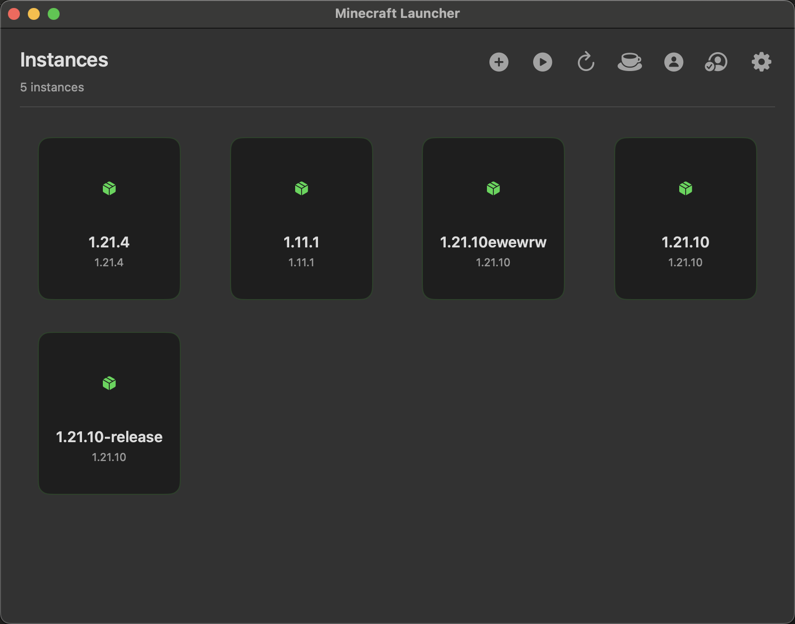
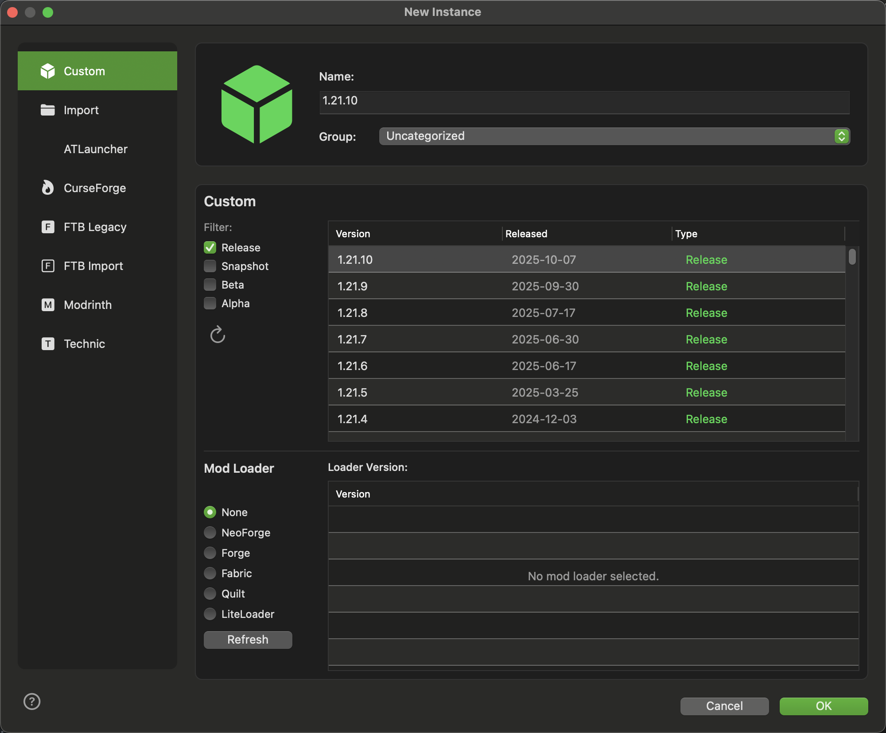
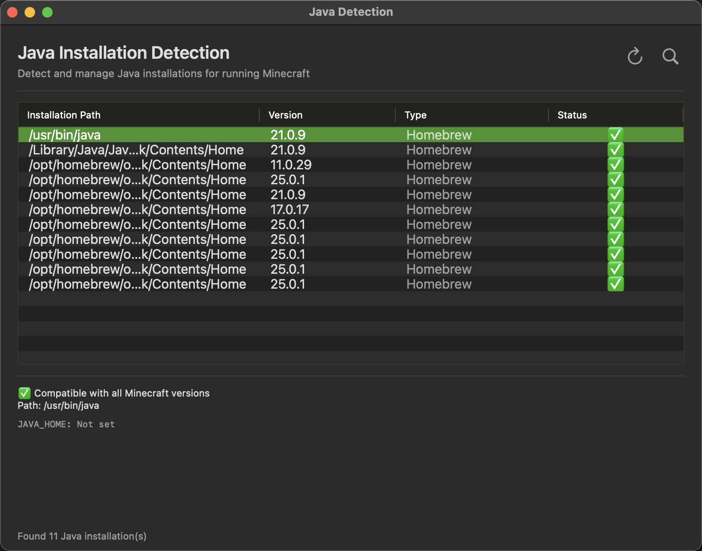
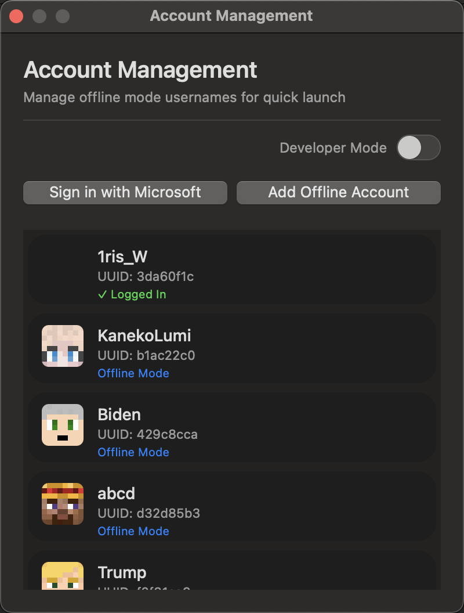
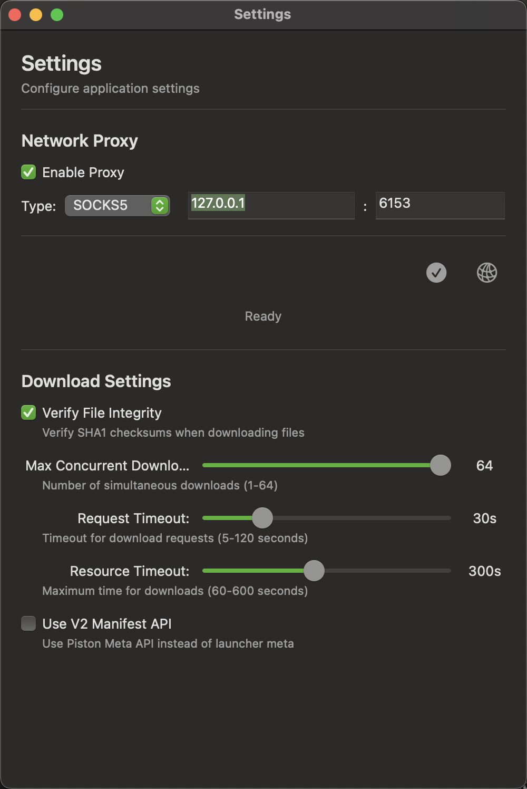
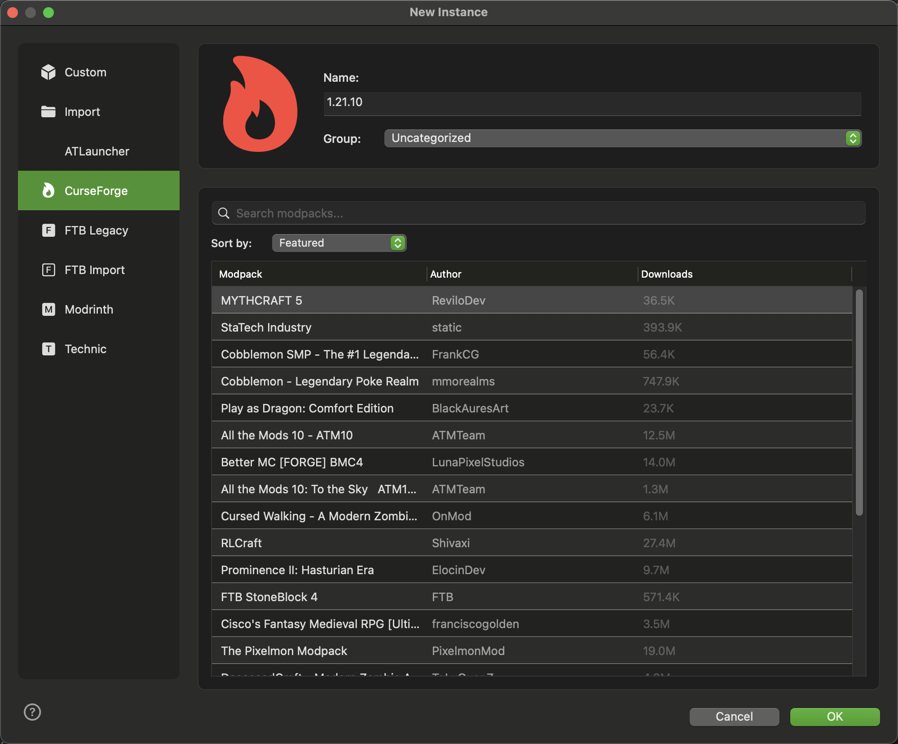

<div align="center">


# Minecraft Launcher

**A feature-rich Minecraft launcher with instance management, mod loader support, CurseForge integration, and Microsoft account authentication**

[](https://swift.org)
[](https://www.apple.com/macos)
[](LICENSE)

English | [简体中文](Docs/README.zh-CN.md)

</div>

---

## Table of Contents

- [Features](#features)
- [Screenshots](#screenshots)
- [Quick Start](#quick-start)
  - [Requirements](#requirements)
  - [Installation](#installation)
  - [Running the Project](#running-the-project)
- [Usage Guide](#usage-guide)
  - [Creating Game Instances](#creating-game-instances)
  - [Adding Accounts](#adding-accounts)
  - [Launching the Game](#launching-the-game)
  - [Importing CurseForge Modpacks](#importing-curseforge-modpacks)
  - [Configuring Proxy (Optional)](#configuring-proxy-optional)
- [Technical Stack](#technical-stack)
- [Development](#development)
  - [Completed Features](#completed-features)
  - [Planned Features](#planned-features)
- [Contributing](#contributing)
- [License](#license)
- [Star History](#star-history)

---

## Features

### 🎮 Game Management
- **Instance Management** - Create, edit, and delete game instances with MMC format support (compatible with Prism Launcher)
- **Game Launch** - Complete launch engine with JVM arguments configuration and native library management
- **Java Detection** - Automatically detect system Java environments and intelligently match version requirements
- **Version Management** - Download, cache, and install various Minecraft versions (release/snapshot/beta/alpha)

### 👤 Account System
- **Microsoft Authentication** - OAuth 2.0 + PKCE security flow with Xbox Live and Minecraft Services support
- **Offline Accounts** - Support for offline mode gameplay
- **Multi-Account Management** - Easily switch between different accounts
- **Token Management** - Automatic authentication token refresh

### 🔧 Mods and Modpacks
- **Mod Loaders** - Support for Forge, Fabric, NeoForge, and Quilt
- **CurseForge Integration** - Search, browse, and import CurseForge modpacks
- **Modpack Management** - Complete modpack support and version management

### ⚙️ Advanced Features
- **Proxy Support** - HTTP/HTTPS/SOCKS5 proxy configuration
- **Concurrent Downloads** - Multi-threaded download system with SHA1 integrity verification
- **Internationalization** - Full support for English and Simplified Chinese
- **Logging System** - Comprehensive multi-level logging

---

## Screenshots

### Instance Management
The instance management interface provides functionality for creating, editing, and managing game instances.



*Instance list view showing all created Minecraft game instances*

### New Instance
Create new game instances through an intuitive dialog with version selection and custom configuration.



*New instance dialog for selecting game version and configuring instance parameters*

### Java Detection
Automatically detect installed Java runtime environments with support for multiple Java versions.



*Java detection interface displaying all available Java versions*

### Account Management
Support for multiple account management, making it easy to switch between different Minecraft accounts.



*Account management interface for adding, editing, and switching game accounts*

### Settings
Comprehensive settings interface providing various configuration options for the launcher.



*Settings interface for configuring launcher parameters and preferences*

### CurseForge Modpack Import
Support for importing modpacks from the CurseForge platform, quickly creating pre-configured game instances.



*CurseForge modpack import interface for directly importing popular modpacks*

---

## Quick Start

### Requirements

- macOS 13.0 (Ventura) or later
- Xcode 15.0 or later
- Swift 5.9 or later

### Installation

1. Clone the repository:
```bash
git clone https://github.com/yourusername/Launcher.git
cd Launcher
```

2. Open the project in Xcode:
```bash
open Launcher/Launcher.xcodeproj
```

### Running the Project

1. Select the `Launcher` scheme in Xcode
2. Press `⌘+R` to build and run
3. Click "Open Test Window" button in the main window
4. Test various features in the test window

---

## Usage Guide

### Creating Game Instances

1. Click the "Add Instance" button on the main interface
2. Enter an instance name in the dialog
3. Select a Minecraft version
4. Choose a mod loader (optional):
   - None (Vanilla)
   - Forge
   - Fabric
   - NeoForge
   - Quilt
5. Click "Create" to complete instance creation

### Adding Accounts

#### Microsoft Account
1. Open the "Account Management" interface
2. Click "Add Microsoft Account"
3. Complete Microsoft login in your browser
4. After authorization, automatically return to the launcher
5. Account successfully added - you can see your player name and skin

#### Offline Account
1. Open the "Account Management" interface
2. Click "Add Offline Account"
3. Enter a player name
4. Click "Add" to complete

### Launching the Game

1. Select an instance from the instance list to play
2. Select an account from the account dropdown menu
3. Click the "Launch" button
4. Wait for the game to launch (first launch will automatically download required files)

### Importing CurseForge Modpacks

1. Click the "Import from CurseForge" button
2. Browse or search for desired modpacks
3. Select a modpack version
4. Click "Import" to start downloading and installing
5. After import completes, the new instance will automatically appear in the instance list

### Configuring Proxy (Optional)

If you need to use a proxy to access Minecraft servers:

1. Open the "Settings" interface
2. Switch to the "Network" tab
3. Enable proxy and select type (HTTP/HTTPS/SOCKS5)
4. Enter proxy server address and port
5. Click "Test Connection" to verify the proxy
6. Save settings

---

## Technical Stack

- **Language**: Swift 5.9+
- **UI Framework**: AppKit (Native macOS)
- **Concurrency**: Swift Concurrency (async/await)
- **Cryptography**: CryptoKit (SHA1 verification)
- **Networking**: URLSession with custom configuration
- **Storage**: FileManager, UserDefaults
- **Logging**: Custom multi-level logging system
- **Internationalization**: xcstrings catalog

---

## Development

### Completed Features

#### Core Features
- [x] Version list fetching and caching
- [x] Version details parsing
- [x] Version inheritance handling
- [x] Multi-threaded download system
- [x] SHA1 integrity verification
- [x] Real-time progress tracking
- [x] Comprehensive logging system
- [x] Version filtering by type
- [x] Proxy support (HTTP/HTTPS/SOCKS5)
- [x] Full internationalization (EN/ZH-CN)
- [x] Installation status checking

#### Game Launch
- [x] Game launch engine
- [x] Offline UUID generation
- [x] JVM arguments configuration
- [x] Game arguments processing
- [x] Native library extraction
- [x] Classpath construction
- [x] Platform compatibility check (macOS optimized)

#### Account System
- [x] Microsoft account authentication
- [x] OAuth 2.0 + PKCE security flow
- [x] Xbox Live integration
- [x] Minecraft Services authentication
- [x] Token refresh mechanism
- [x] Offline account support
- [x] Account management interface

#### Instance Management
- [x] Instance creation and deletion
- [x] MMC format support (compatible with Prism Launcher)
- [x] Instance configuration management
- [x] Game directory isolation (mods, saves, resourcepacks, etc.)
- [x] Instance list interface
- [x] Instance details viewing and editing

#### Mod Loaders
- [x] Forge support
- [x] Fabric support
- [x] NeoForge support
- [x] Quilt support
- [x] Mod loader version management

#### CurseForge Integration
- [x] CurseForge API client
- [x] Modpack search functionality
- [x] Modpack details retrieval
- [x] Pagination and sorting support
- [x] CurseForge import interface

#### Java Environment
- [x] Automatic Java installation detection
- [x] Multi-version Java management
- [x] Java version matching (based on Minecraft version)
- [x] Java detection interface

### Planned Features

#### Core Enhancements
- [ ] Auto-update functionality
- [ ] Pre-launch resource integrity check
- [ ] Custom launch argument templates
- [ ] Performance monitoring and log viewer

#### CurseForge Features
- [ ] Modpack download and installation
- [ ] Automatic modpack updates
- [ ] Mod browsing and search
- [ ] Individual mod install/update/uninstall

#### Resource Management
- [ ] Resource pack browsing and management
- [ ] Shader pack support
- [ ] Data pack management
- [ ] World backup and restore

#### Multiplayer
- [ ] Server list management
- [ ] Quick server connect
- [ ] LAN game support

#### User Experience
- [ ] Theme and appearance customization
- [ ] More language support
- [ ] Keyboard shortcut configuration
- [ ] Instance import/export (support more formats)

#### Advanced Features
- [ ] Batch operations (batch update, batch delete, etc.)
- [ ] Instance template system
- [ ] Cloud sync support
- [ ] Plugin system

---

## Contributing

Contributions are welcome! Please feel free to submit a Pull Request.

> **⚠️ Important Note**
> The UI component library used in this project is not yet open source. If you would like to contribute to development, please contact me through [Issues](https://github.com/LemniAnvil/Launcher/issues) or other means.

### Guidelines

1. Fork the repository
2. Create your feature branch (`git checkout -b feature/AmazingFeature`)
3. Commit your changes (`git commit -m 'Add some AmazingFeature'`)
4. Push to the branch (`git push origin feature/AmazingFeature`)
5. Open a Pull Request

---

## License

This project is licensed under the GNU Affero General Public License v3.0 (AGPL-3.0) - see the [LICENSE](LICENSE) file for details.

---

## Star History

[](https://www.star-history.com/#LemniAnvil/Launcher&type=date&legend=top-left)

---

<div align="center">

[⬆ Back to Top](#minecraft-launcher)

</div>

