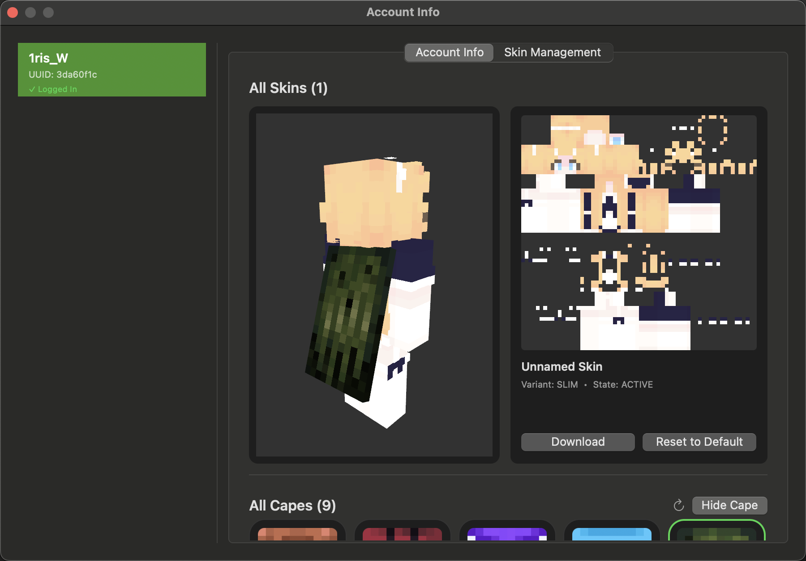
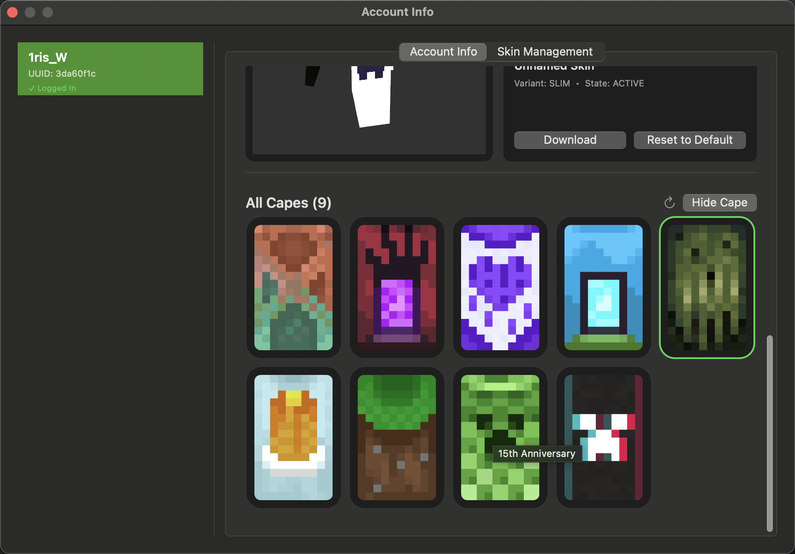
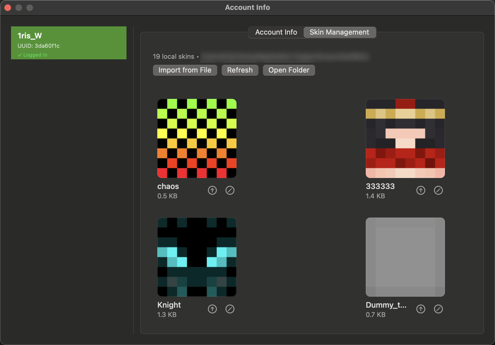

<div align="center">


# Minecraft Launcher

**A macOS Minecraft launcher with instance management, version downloads, CurseForge browsing, and Microsoft account authentication**

[](https://swift.org)
[](https://www.apple.com/macos)
[](LICENSE)

English | [简体中文](Docs/README.zh-CN.md)

</div>

---

## Table of Contents

- [Features](#features)
- [Screenshots](#screenshots)
- [Quick Start](#quick-start)
  - [Requirements](#requirements)
  - [Installation](#installation)
  - [Running the Project](#running-the-project)
- [Usage Guide](#usage-guide)
  - [Creating Game Instances](#creating-game-instances)
  - [Adding Accounts](#adding-accounts)
  - [Launching the Game](#launching-the-game)
  - [CurseForge Modpacks](#curseforge-modpacks)
  - [Configuring Proxy (Optional)](#configuring-proxy-optional)
- [Technical Stack](#technical-stack)
- [Development](#development)
  - [Completed Features](#completed-features)
  - [Planned Features](#planned-features)
- [Contributing](#contributing)
- [License](#license)
- [Star History](#star-history)

---

## Features

### Game Management
- **Instance Management** - Create and delete instances, stored in MMC format for Prism Launcher compatibility
- **Prism Launcher Discovery** - Load external Prism Launcher instances from the default instances directory
- **Game Launch** - Build JVM/game arguments, extract natives, and launch Minecraft (including offline launch flow)
- **Java Detection** - Detect installed Java runtimes and show compatibility hints
- **Version Management** - Fetch Mojang version metadata, cache it locally, and download versions on demand

### Account System
- **Microsoft Authentication** - OAuth 2.0 + PKCE flow with Xbox Live and Minecraft Services support
- **Offline Accounts** - Local offline profiles for quick launch
- **Multi-Account Management** - Store multiple accounts and switch the active one
- **Token Refresh** - Refresh Microsoft tokens and update stored account data
- **Skin and Cape Tools** - Preview, activate, reset, download, and upload skins; browse and manage capes; manage a local skin library

### Mods and Modpacks
- **Mod Loader Selection** - Fetch loader versions for Forge/Fabric/NeoForge/Quilt and record loader metadata in MMC packs
- **CurseForge Browser** - Search and browse modpacks and available files (requires a CurseForge API key)

### Advanced Features
- **Proxy Support** - HTTP/HTTPS/SOCKS5 proxy configuration with test and system proxy detection
- **Concurrent Downloads** - Multi-threaded download system with retries and SHA1 verification
- **Internationalization** - English and Simplified Chinese support
- **Logging System** - Multi-level logging with categorized output

---

## Screenshots

### Instance Management
The instance management interface provides functionality for creating and managing game instances.


*Instance list view showing all created Minecraft game instances*

### New Instance
Create new game instances through a dialog with version and optional mod loader selection.


*New instance dialog for selecting game version and optional mod loader*

### Java Detection
Automatically detect installed Java runtime environments with support for multiple Java versions.


*Java detection interface displaying all available Java versions*

### Account Management
Support for multiple account management, making it easy to add, remove, and switch between accounts.


*Account management interface for adding, deleting, and switching game accounts*

### Account Info & Skins
Preview the active skin and manage account skins directly from the info panel.



*Account info view with skin preview and skin actions*

### Cape Collection
Browse all owned capes and manage the currently equipped cape.



*Cape gallery showing available capes*

### Skin Management
Manage local skin files, import new skins, and access the skins folder.



*Skin management view for local skin assets*

### Settings
Storage and maintenance settings for managing launcher data locations and cache.


*Settings view showing storage locations and maintenance actions*

### Activity Monitor
Inspect the launcher's process in macOS Activity Monitor.


*Launcher process shown in macOS Activity Monitor*

### CurseForge Modpack Browser
Browse CurseForge modpacks and inspect available files/versions.


*CurseForge modpack browser with search and version selection*

---

## Quick Start

### Requirements

- macOS 13.0 (Ventura) or later
- Xcode 15.0 or later
- Swift 5.9 or later

### Installation

1. Clone the repository:
```bash
git clone https://github.com/LemniAnvil/Launcher.git
cd Launcher
```

2. Open the project in Xcode:
```bash
open Launcher/Launcher.xcodeproj
```

### Running the Project

1. Select the `Launcher` scheme in Xcode
2. Press `⌘+R` to build and run
3. Use the toolbar buttons to open Add Instance, Account Management, Account Info, Settings, and Installed Versions windows
4. Create an instance and explore the available features

---

## Usage Guide

### Creating Game Instances

1. Click the "Add Instance" button on the main interface
2. Enter an instance name in the dialog
3. Select a Minecraft version
4. Choose a mod loader (optional):
   - None (Vanilla)
   - Forge
   - Fabric
   - NeoForge
   - Quilt
   - Note: Mod loader selection is stored in the MMC metadata; installer download is not automated yet
5. Click "Create" to complete instance creation

### Adding Accounts

#### Microsoft Account
1. Open the "Account Management" interface
2. Click "Sign in with Microsoft"
3. Complete Microsoft login in your browser
4. Return to the launcher to finish authorization
5. Account successfully added - you can see your player name and skin

#### Offline Account
1. Open the "Account Management" interface
2. Click "Add Offline Account"
3. Enter a player name
4. Click "Add" to complete

### Launching the Game

1. Select an instance from the instance list to play
2. Select an account from the account dropdown menu
3. Click the "Launch" button
4. Wait for the game to launch (first launch will automatically download required files)

### CurseForge Modpacks

1. Click the "Add Instance" button
2. Switch to the "CurseForge" category
3. Browse or search for desired modpacks
4. Select a modpack to view available files/versions
5. Note: this view currently focuses on browsing; one-click import is not wired yet

### Configuring Proxy (Optional)

If you need to use a proxy to access Minecraft servers:

1. Open the "Settings" interface
2. Switch to the "Network Proxy" tab
3. Enable proxy and select type (HTTP/HTTPS/SOCKS5)
4. Enter proxy server address and port
5. Click "Test Connection" to verify the proxy
6. Save settings

---

## Technical Stack

- **Language**: Swift 5.9+
- **UI Framework**: AppKit (Native macOS)
- **Concurrency**: Swift Concurrency (async/await)
- **Cryptography**: CryptoKit (SHA1 verification)
- **Networking**: URLSession with custom configuration
- **Storage**: FileManager, UserDefaults
- **Logging**: Custom multi-level logging system
- **Internationalization**: xcstrings catalog

---

## Development

### Completed Features

#### Core Features
- [x] Version list fetching and caching
- [x] Version details parsing
- [x] Version inheritance handling
- [x] Multi-threaded download system
- [x] SHA1 integrity verification
- [x] Real-time progress tracking
- [x] Comprehensive logging system
- [x] Version filtering by type
- [x] Proxy support (HTTP/HTTPS/SOCKS5)
- [x] Full internationalization (EN/ZH-CN)
- [x] Installation status checking

#### Game Launch
- [x] Game launch engine
- [x] Offline UUID generation
- [x] JVM arguments configuration
- [x] Game arguments processing
- [x] Native library extraction
- [x] Classpath construction
- [x] Platform compatibility check (macOS optimized)

#### Account System
- [x] Microsoft account authentication
- [x] OAuth 2.0 + PKCE security flow
- [x] Xbox Live integration
- [x] Minecraft Services authentication
- [x] Token refresh mechanism
- [x] Offline account support
- [x] Account management interface

#### Instance Management
- [x] Instance creation and deletion
- [x] MMC format support (compatible with Prism Launcher)
- [x] Instance list interface
- [x] Instance detail view (read-only configuration summary)
- [x] Game directory isolation (mods, saves, resourcepacks, etc.)

#### Mod Loaders
- [x] Loader metadata for Forge/Fabric/NeoForge/Quilt
- [x] Mod loader version listing

#### CurseForge Integration
- [x] CurseForge API client
- [x] Modpack search functionality
- [x] Modpack details retrieval
- [x] Pagination and sorting support
- [x] CurseForge browsing interface

#### Java Environment
- [x] Automatic Java installation detection
- [x] Multi-version Java detection
- [x] Java compatibility hints (based on major version ranges)
- [x] Java detection interface

### Planned Features

#### Core Enhancements
- [ ] Auto-update functionality
- [ ] Pre-launch resource integrity check
- [ ] Custom launch argument templates
- [ ] Performance monitoring and log viewer

#### CurseForge Features
- [ ] Modpack download and installation
- [ ] Automatic modpack updates
- [ ] Mod browsing and search
- [ ] Individual mod install/update/uninstall

#### Resource Management
- [ ] Resource pack browsing and management
- [ ] Shader pack support
- [ ] Data pack management
- [ ] World backup and restore

#### Multiplayer
- [ ] Server list management
- [ ] Quick server connect
- [ ] LAN game support

#### User Experience
- [ ] Theme and appearance customization
- [ ] More language support
- [ ] Keyboard shortcut configuration
- [ ] Instance import/export (support more formats)

#### Advanced Features
- [ ] Batch operations (batch update, batch delete, etc.)
- [ ] Instance template system
- [ ] Cloud sync support
- [ ] Plugin system

---

## Contributing

Contributions are welcome! Please feel free to submit a Pull Request.

> **Important Note**
> The UI component library used in this project is not yet open source. If you would like to contribute to development, please contact me through [Issues](https://github.com/LemniAnvil/Launcher/issues) or other means.

### Guidelines

1. Fork the repository
2. Create your feature branch (`git checkout -b feature/AmazingFeature`)
3. Commit your changes (`git commit -m 'Add some AmazingFeature'`)
4. Push to the branch (`git push origin feature/AmazingFeature`)
5. Open a Pull Request

---

## License

This project is licensed under the GNU Affero General Public License v3.0 (AGPL-3.0) - see the [LICENSE](LICENSE) file for details.

---

## Star History

[](https://www.star-history.com/#LemniAnvil/Launcher&type=date&legend=top-left)

---

<div align="center">

[⬆ Back to Top](#minecraft-launcher)

</div>
