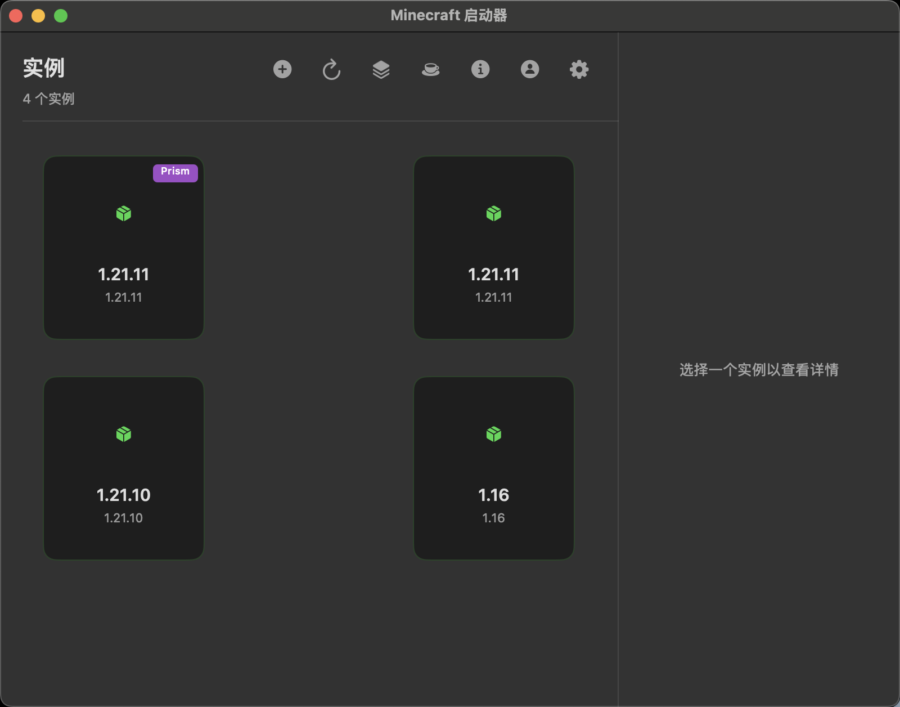
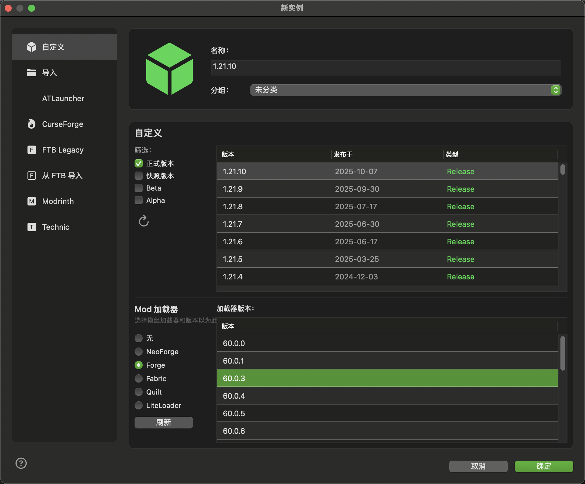
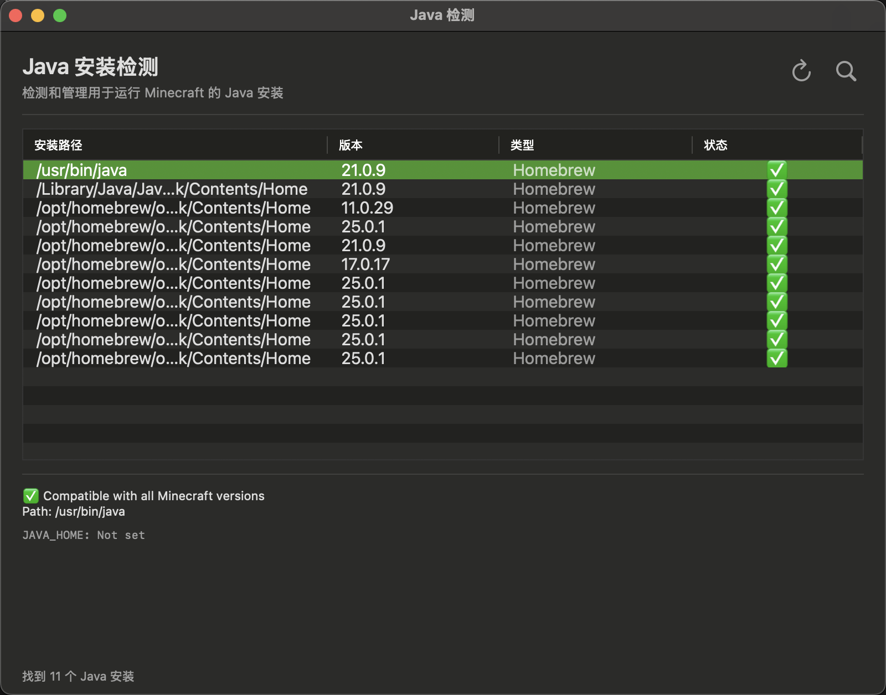
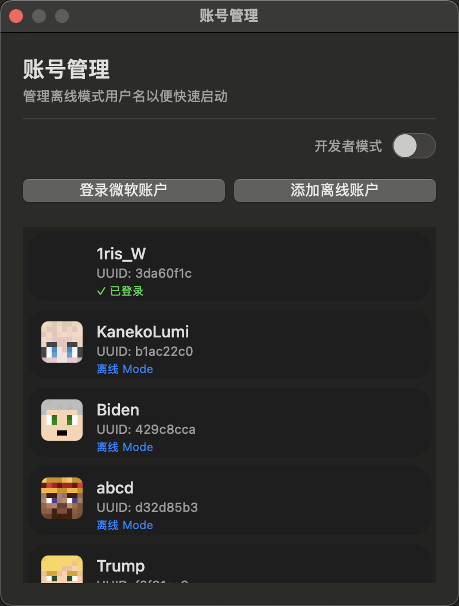
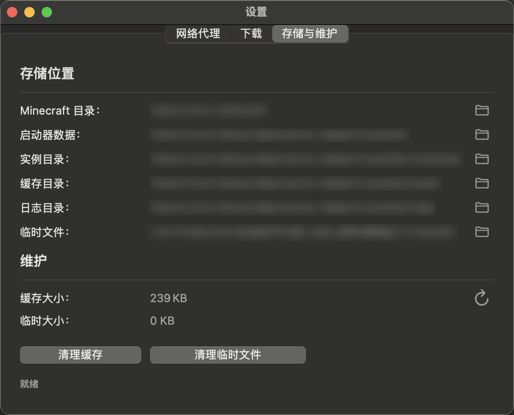

<div align="center">


# Minecraft 启动器

**使用 Swift 开发的现代化 Minecraft 启动器（macOS 平台）**

[](https://swift.org)
[](https://www.apple.com/macos)
[](LICENSE)

[English](README.md) | 简体中文

</div>

---

## 目录

- [功能特性](#功能特性)
- [截图预览](#截图预览)
- [快速开始](#快速开始)
  - [系统要求](#系统要求)
  - [安装说明](#安装说明)
  - [运行项目](#运行项目)
- [项目结构](#项目结构)
- [使用指南](#使用指南)
  - [测试窗口功能](#测试窗口功能)
  - [版本选择](#版本选择)
  - [代理配置](#代理配置)
- [技术栈](#技术栈)
- [架构设计](#架构设计)
- [下载说明](#下载说明)
- [开发进度](#开发进度)
  - [已完成功能](#已完成功能)
  - [计划功能](#计划功能)
- [贡献指南](#贡献指南)
- [许可证](#许可证)
- [Star History](#star-history)

---

## 功能特性

### 核心功能
- **版本管理** - 从官方 API 获取、解析、缓存 Minecraft 版本
- **下载系统** - 多线程并发下载，支持 SHA1 校验
- **代理支持** - 支持 HTTP/HTTPS/SOCKS5 代理配置
- **版本筛选** - 按正式版、快照版、Beta、Alpha 筛选
- **安装检测** - 自动检测已安装的版本
- **国际化** - 完整支持英文和简体中文

### 技术特性
- 版本继承处理（支持 Forge/Fabric）
- 平台兼容性检查（macOS 优化）
- 智能文件校验（自动跳过已存在文件）
- 实时进度追踪和速度显示
- Swift Concurrency 异步编程
- 完善的日志系统

---

## 截图预览

### 实例管理
实例管理界面提供了游戏实例的创建、编辑和管理功能。



*实例列表界面，显示所有已创建的 Minecraft 游戏实例*

### 新建实例
通过直观的对话框创建新的游戏实例，支持选择版本和自定义配置。



*新建实例对话框，可选择游戏版本并配置实例参数*

### Java 环境检测
自动检测系统中已安装的 Java 运行环境，支持多版本 Java 管理。



*Java 环境检测界面，显示所有可用的 Java 版本*

### 账户管理
支持多账户管理，方便切换不同的 Minecraft 账户进行游戏。



*账户管理界面，支持添加、编辑和切换游戏账户*

### 设置中心
全面的设置界面，提供启动器的各项配置选项。



*设置界面，可配置启动器的各项参数和偏好设置*

---

## 快速开始

### 系统要求

- macOS 13.0 (Ventura) 或更高版本
- Xcode 15.0 或更高版本
- Swift 5.9 或更高版本

### 安装说明

1. 克隆仓库：
```bash
git clone https://github.com/yourusername/Launcher.git
cd Launcher
```

2. 在 Xcode 中打开项目：
```bash
open Launcher/Launcher.xcodeproj
```

### 运行项目

1. 在 Xcode 中选择 `Launcher` scheme
2. 按 `⌘+R` 构建并运行
3. 在主窗口中点击"打开测试窗口"按钮
4. 在测试窗口中测试各种功能

---

## 项目结构

```
Launcher/
├── Launcher/
│   ├── Models/                 # 数据模型
│   │   ├── Version.swift       # Minecraft 版本数据结构
│   │   ├── Library.swift       # 库依赖模型
│   │   ├── Asset.swift         # 游戏资源模型
│   │   └── Download.swift      # 下载任务模型
│   ├── Managers/               # 管理器类
│   │   ├── VersionManager.swift    # 版本管理
│   │   ├── DownloadManager.swift   # 下载管理
│   │   └── ProxyManager.swift      # 代理配置
│   ├── Utils/                  # 工具类
│   │   ├── Logger.swift        # 日志系统
│   │   ├── FileUtils.swift     # 文件操作
│   │   └── VersionManifestParser.swift
│   ├── Application/            # 应用层
│   │   └── Localized.swift     # 本地化字符串
│   ├── Views/                  # 用户界面
│   │   ├── ViewController.swift
│   │   ├── TestWindowController.swift
│   │   └── TestViewController.swift
│   └── Resources/              # 资源文件
│       ├── Assets.xcassets/    # 应用图标和图片
│       └── Localizable.xcstrings   # 本地化目录
├── LauncherTests/              # 单元测试
└── LauncherUITests/            # UI 测试
```

---

## 使用指南

### 测试窗口功能

测试窗口提供 5 个主要测试功能：

1. **刷新版本列表** - 从 Mojang API 获取所有可用版本
   - 显示最新正式版和快照版
   - 显示版本类型统计
   - 本地缓存版本数据

2. **获取版本详情** - 解析选定版本的详细信息
   - 主类信息
   - Java 版本要求
   - 库依赖
   - 资源索引详情

3. **下载测试文件** - 测试下载功能
   - 下载版本清单
   - 验证文件完整性
   - 报告下载速度

4. **检查已安装版本** - 扫描本地已安装的版本
   - 列出所有已安装版本
   - 显示文件大小
   - 显示安装路径

5. **下载完整版本** - 下载完整游戏文件
   - 下载游戏核心（JAR 文件）
   - 下载所有必需的库
   - 下载游戏资源
   - 显示实时进度

### 版本选择

- **可视化表格视图**：在有组织的表格中浏览版本
- **版本筛选**：使用复选框按类型筛选
  - 🟢 正式版 - 稳定版本
  - 🟡 快照版 - 开发快照
  - 🔵 Beta - 旧版 Beta
  - 🟣 Alpha - 旧版 Alpha
- **安装状态**：显示哪些版本已经安装
- **智能选择**：自动选择最新正式版
- **双击操作**：双击版本开始下载

### 代理配置

配置网络代理以访问 Mojang 服务：

1. 勾选"启用代理"
2. 选择代理类型（HTTP/HTTPS/SOCKS5）
3. 输入代理主机和端口
4. 点击"应用代理"激活
5. 使用"测试代理"验证连接

---

## 技术栈

- **语言**: Swift 5.9+
- **UI 框架**: AppKit（原生 macOS）
- **并发**: Swift Concurrency (async/await)
- **加密**: CryptoKit（SHA1 校验）
- **网络**: URLSession 自定义配置
- **存储**: FileManager、UserDefaults
- **日志**: 自定义多级别日志系统
- **国际化**: xcstrings 目录

---

## 架构设计

### 设计模式

- **MVVM 架构**：清晰的关注点分离
- **单例模式**：共享管理器（VersionManager、DownloadManager）
- **Async/Await**：使用 Swift Concurrency 的现代并发
- **面向协议**：灵活且可测试的代码结构

### 关键组件

1. **VersionManager**
   - 管理版本清单和缓存
   - 处理版本继承
   - 解析版本 JSON 数据

2. **DownloadManager**
   - 并发下载队列
   - 进度追踪和报告
   - SHA1 完整性验证
   - 代理配置支持

3. **ProxyManager**
   - 配置 HTTP/HTTPS/SOCKS5 代理
   - 测试代理连接
   - 管理代理状态

4. **Logger**
   - 多级别日志（Debug、Info、Warning、Error）
   - 基于文件的日志存储
   - 带时间戳的控制台输出

---

## 下载说明

### 文件位置

```
~/.minecraft/
├── versions/          # 版本文件
│   └── {version}/
│       ├── {version}.jar
│       └── {version}.json
├── libraries/         # 库依赖
├── assets/           # 游戏资源
│   ├── indexes/
│   └── objects/
└── logs/             # 启动器日志
```

### 磁盘空间要求

- 单个版本：约 500MB - 1GB
- 完整设置：建议 5GB+
- 资源在版本间共享

### 网络要求

- 需要稳定的互联网连接
- Mojang 服务器位于海外
- 某些地区建议使用代理以获得最佳速度

---

## 开发进度

### 已完成功能

- [x] 版本列表获取和缓存
- [x] 版本详情解析
- [x] 版本继承处理
- [x] 多线程下载系统
- [x] SHA1 完整性校验
- [x] 实时进度追踪
- [x] 完善的日志系统
- [x] 带可视化表格的测试界面
- [x] 按类型筛选版本
- [x] 代理支持（HTTP/HTTPS/SOCKS5）
- [x] 完整国际化（英文/简体中文）
- [x] 安装状态检查

### 计划功能

- [ ] 游戏启动引擎
- [ ] Microsoft 账户认证
- [ ] 完整启动器 UI 重新设计
- [ ] 配置管理系统
- [ ] Mod 加载器支持（Forge/Fabric/Quilt）
- [ ] 配置文件管理
- [ ] 自动更新功能
- [ ] 资源包管理
- [ ] 光影包支持
- [ ] 服务器管理

---

## 贡献指南

欢迎贡献！请随时提交 Pull Request。

> **⚠️ 重要提示**
> 当前项目使用的 UI 组件库尚未开源。如果您希望参与开发，请通过 [Issues](https://github.com/LemniAnvil/Launcher/issues) 或其他方式与我联系。

### 指南

1. Fork 仓库
2. 创建功能分支 (`git checkout -b feature/AmazingFeature`)
3. 提交更改 (`git commit -m 'Add some AmazingFeature'`)
4. 推送到分支 (`git push origin feature/AmazingFeature`)
5. 开启 Pull Request

---

## 许可证

本项目基于 GNU Affero General Public License v3.0 (AGPL-3.0) - 详见 [LICENSE](LICENSE) 文件

---

## Star History

[](https://www.star-history.com/#LemniAnvil/Launcher&type=date&legend=top-left)

---

<div align="center">

[⬆ 返回顶部](#minecraft-启动器)

</div>
